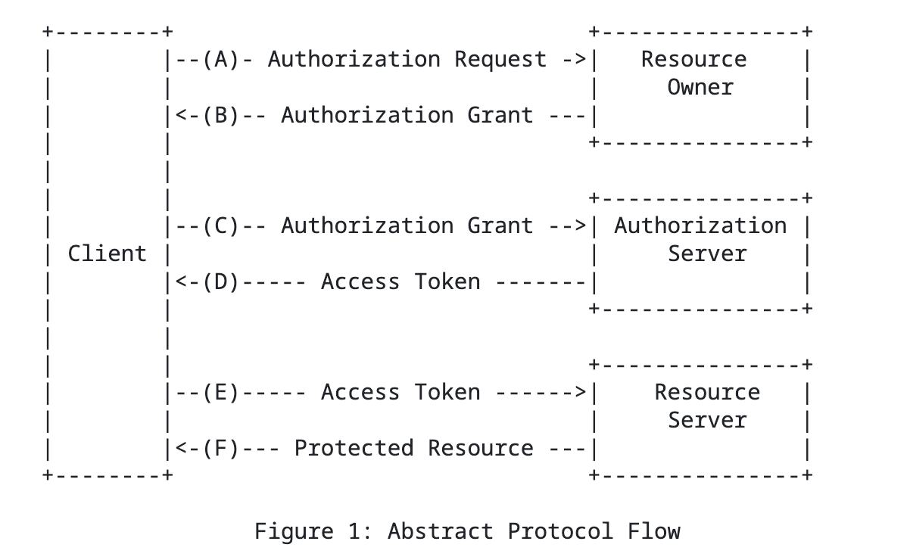
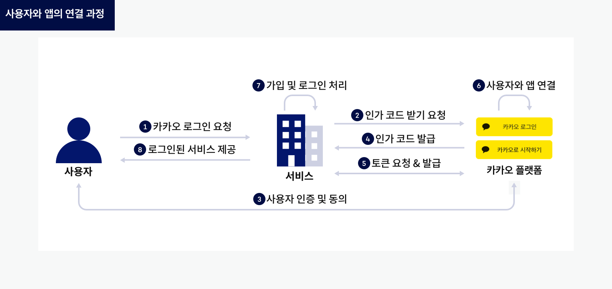

# OAuth 

방끗 팀 프로젝트에서는 카카오 로그인을 통해 사용자의 인증/인가를 구현한다. 카카오 로그인은 카카오 계정을 사용해 다양한 서비스에 로그인할 수 있도록하는 OAuth 2.0 기반의 소셜 로그인 서비스이다. 단순히 카카오에서 제공하는 문서를 따라 구현하는 것을 넘어, OAuth 기술을 제대로 이해하고 활용하고자 한다. 특히 네트워크 통신을 통해 인증과 인가를 처리하는 과정에서 보안이 중요한 요소로 작용하기 때문에, OAuth 사용 시 발생할 수 있는 잠재적인 문제들을 분석하고 보완하려고 한다. 또한, OAuth 기술을 더 폭넓게 활용할 수 있는 방법도 함께 모색하고자 한다.

## 1. OAuth 개요

OAuth 프로토콜은 클라이언트에게 리소스 오너를 대신해서 서버의 리소스에 접근할 수 있는 방법을 제공하는 기술이다. 

OAuth 프로토콜은 보호된 리소스에 대한 접근 권한을 위임하는 과정에서의 공통된 문제를 해결하기 위해 다양한 웹사이트 및 인터넷 서비스의 웹 개발자들로 구성된 소규모 커뮤니테에서 만들어졌다. OAuth 프로토콜의 첫 번째 버전(1.0)은 2007년에 안정화되었고, 2009년 6월에 개정되었다.

OAuth에 대해 설명하기 앞서 OAuth 용어를 정리할 필요가 있다. 이러한 용어들은 OAuth 프로토콜 내에서 중요한 역할을 하며, 개념을 정확히 이해하는 데 필수적인 요소들이다. 다음은 OAuth에서 자주 사용되는 주요 용어들에 대한 정의이다.

## 1.1 OAuth 용어 정리

| 용어                  | 설명                                                                                                      |
|---------------------|---------------------------------------------------------------------------------------------------------|
| Client(클라이언트)      | OAuth 인증 요청을 할 수 있는 HTTP 클라이언트이다.                                                           |
| Server(서버)          | OAuth 인증 요청을 수락할 수 있는 HTTP 서버이다.                                                           |
| Protected Resource(보호된 리소스) | OAuth 인증 요청을 사용해서 서버에서 가져올 수 있는 제한된 리소스                              |
| Resource Owner(리소스 오너) | 자격 증명을 사용하여 서버에 인증함으로써 보호된 리소스에 접근하거나 통제할 수 있는 주체                |
| Credentials(자격 증명)   | 고유한 식별자와 매칭되는 공유키(shared secret)의 한 쌍이다. OAuth에서는 자격 증명을 client, temporary, and token으로 구분한다. |
| Token(토큰)          | 서버에 의해 발행되고 클라이언트에 의해 사용되는 고유한 식별자이다. 리소스 소유자를 대신할 수 있는 권한을 확인하기 위해 shared-secret와 일치하는 값을 가지고 있다. |

## 1.2 OAuth 등장 배경

전통적인 클라이언트-서버 인증 모델에서는 클라이언트가 서버에 리소스 소유자의 인증 정보를 제공하여 보호된 리소스에 접근하는 방식이 사용되었다. 하지만 서드파티 애플리케이션이 리소스 소유자의 리소스에 접근할 수 있도록 하기 위해서는, 리소스 소유자가 자신의 인증 정보를 서드파티 애플리케이션과 공유해야 했다. 이 방식에는 여러 가지 문제가 있다.

첫째, 서드파티 애플리케이션이 리소스 소유자의 인증 정보를 저장해야 하며, 대부분의 경우 이 정보를 평문으로 저장하여 보안 문제가 발생할 수 있다. 둘째, 서드파티 애플리케이션이 리소스 소유자로부터 지나치게 광범위한 접근 권한을 부여받게 되어, 필요 이상으로 많은 권한을 행사할 수 있다. 셋째, 서드파티 애플리케이션이 손상되면 사용자의 비밀번호뿐만 아니라, 그 비밀번호로 보호되는 모든 데이터가 노출될 위험이 있다.

이러한 보안 문제를 해결하기 위해 OAuth 기술이 도입되었다. OAuth는 권한 부여 계층을 도입하여 클라이언트와 리소스 소유자의 역할을 분리한다. OAuth를 통해 클라이언트는 리소스 소유자가 제어하고 리소스 서버가 호스팅하는 서버에 접근할 수 있지만, 리소스 소유자의 인증 정보를 직접 사용하는 대신 액세스 토큰이라는 인증 수단을 사용하게 된다. 액세스 토큰은 리소스 소유자의 승인 하에 서드파티 애플리케이션에 발급되며, 이 토큰을 통해 서드파티 애플리케이션은 리소스에 접근할 수 있다.

## 1.3 OAuth 1.0과 2.0 차이

OAuth 1.0과 OAuth 2.0은 인터넷 사용자가 애플리케이션에 자신을 인증하지 않고도 리소스 서버에 자신의 데이터를 안전하게 사용할 수 있도록 하는 권한 부여 프로토콜이다. 하지만 OAuth 2.0 프로토콜은 OAuth 1.0 프로토콜과 하위 호환되지 않으며 매우 다른 구현 세부사항을 가지고 있다. 두 버전 간의 몇 가지 중요한 차이점을 살펴보며 OAuth 2.0 프로토콜의 특징을 이해하고자 한다.

첫째, 복잡도와 사용 편의성 측면에서 차이가 있다. OAuth 1.0은 요청마다 암호화된 서명을 요구하는 복잡한 방식이었으며 클라이언트는 HMAC-SHA1 또는 RSA-SHA1과 같은 서명 알고리즘을 사용해 각 요청을 암호화해야 했다. 반면, OAuth 2.0은 서명을 요구하지 않고, TLS/SSL을 통해 통신 보안을 보장함으로써 인증 절차를 단순화했다. 이는 OAuth 2.0이 구현과 사용이 훨씬 간편해졌음을 의미한다.

둘째. Scope 기능이 추가되면서 클라이언트가 리소스 서버에 요청하는 권한을 세분화하여 정의할 수 있다. 리소스 소유자가 서드파티 애플리케이션에 필요한 최소한의 권한만을 위임할 수 있게 한다. 이 기능은 보안 측면에서 중요한 역할을 한다. 애플리케이션이 모든 권한을 요청하지 않고 필요한 권한만 요청함으로써, 리소스 소유자의 불필요한 권한 노출을 방지할 수 있다.

셋째, 서버의 역할의 중요한 변화가 있었다. Authorization Server(권한 서버)와  Resource Server(리소스 소버)의 역할이 명확하게 분리되었다. OAtuth 1.0에서는 서버가 모든 역할을 담당했다. 클라이언트가 자원에 접근할 때 리소스 소유자 인증, 인가 토큰 발급, 보호된 리소스를 관래했다. OAuth 2.0 에서 권한 서버가 주로 인증과 권한 부여를 담당하며 리소스 소유자의 인증 정보와 클라이언트의 요청을 검증한 후, 그 요청에 맞는 액세스 토큰을 발급한다. 또한 리소스 서버는 클라이언트로부터 받은 액세스 토큰의 유효성을 확인하고 유효한 토큰이라면 요청된 리소스를 제공하게 된다. 이를 통해 보안, 확장성, 유연성을 높였으며 다양한 클라이언트 및 서비스 환경에 더 나은 인증/인가 경험을 제공할 수 있게 했다.

넷째, 토큰 탈취 문제를 개선했다. 액세스 토큰은 기본적으로 리소스에 접근할 수 있는 인증 수단이다. 클라이언트가 보호된 리소스에 접근하려면 이 토큰을 사용해 인증을 받아야 한다. OAuth 1.0에서는 주로 액세스 토큰을 긴 시간 동안 사용하거나 갱신없이 재사용하는 방식이었으며, 이로 인해 토큰 탈취나 남용에 대한 위험이 존재했다. OAuth 2.0부터는 리프레시 토큰 개념이 도입되었다. 액세스 토큰의 만료 시간을 짧게 설정하고, 시간이 만료되면 리프레시 토큰을 통해 새 액세스 토큰을 받을 수 있다.

마지막으로 OAuth 2.0은 OAuth 1.0에 비해 더 유연하고 다양한 사용 환경에서 적용될 수 있도록 많은 개선이 이루어졌다. OAuth 1.0에서는 한 가지 방식의 권한 부여만 지원했다. 모든 클라이언트가 동일한 방식으로 권한을 요청하고 리소스에 접근하는 방식이었기 때문에 상황에 맞는 최적화된 권한 요청 방식을 선택할 수 없었다. OAuth 2.0에서는 Authorization Code, Implicit, Resource Owner Password Credentials, Client Credentials 이라는 권한 부여 방식을 도입해 다양한 시나리오에 맞는 권한 부여가 가능해지도록 했다.

이로써 OAuth 1.0에서 개선된 OAuth 2.0은 현재 가장 널리 사용되는 인가 프로토콜과 버전이다. 많은 기업들이 OAuth 2.0 수준의 스펙을 구현하고 있다.

## 2. OAuth 2.0 동작 메커니즘

카카오 로그인은 OAuth 2.0을 기반으로 동작한다. OAuth 2.0의 동작 메커니즘과 함께 방끗 팀 프로젝트에서 구현한 코드를 살펴보자.


## 2.1 Roles

OAuth 2.0에서는 새롭게 4가지 역할을 정의한다.

| 용어                    | 설명                                                                                                     |
|-----------------------|--------------------------------------------------------------------------------------------------------|
| resource owner        | 보호된 리소스에 접근 권한을 부여할 수 있는 주체, 보통 사용자를 의미한다.                                     |
| resource server       | 액세스 토큰을 사용해 보호된 리소스 요청을 처리하는 서버                                                  |
| client                | 리소스 소유자의 승인 하에 보호된 리소스 요청을 수행하는 애플리케이션                                    |
| authorization server   | 리소스 소유자를 인증하고 권한을 얻은 후 클라이언트에게 액세스 토큰을 발급하는 서버                      |

## 2.2 OAuth 2.0 메커니즘

OAuth 2.0 흐름은 4가지 역할 간의 상호작용을 설명하며 다음 단계들을 포함한다.



(A) 클라이언트가 리소스 소유자에게 권한을 요청한다. 권한 요청은 리소스 소유자에게 직접 하거나 권한 서버를 중간 매개로 사용하여 간접적으로 요청할 수 있다.

(B) 클라이언트는 권한 부여를 받는다. 권한 부여는 리소스 소유자의 권한을 나타내는 자격 증명으로, 4가지의 권한 부여 유형이 있지만 이는 클라이언트가 권한을 요청하는 방식과 권한 서버에서 지원하는 유형에 따라 달라진다.

(C) 클라이언트는 인증 서버에 인증을 하고 권한 부여를 제출하여 액세스 토큰을 요청한다.

(D) 권한 서버는 클라이언트를 인증하고 권한 부여를 검증한 후, 유효하면 액세스 토큰을 발급한다.

(E) 클라이언트는 리소스 서버에 보호된 리소스를 요청하고 액세스 토큰을 제시하여 인증을 진행한다.

(F) 리소스 서버는 액세스 토큰을 검증하고 유효하면 요청한 리소스를 제공한다.


## 2.3 코드를 통해 살펴보는 OAuth 2.0 메커니즘

사용자 연결 후 서비스 가입 과정에 대한 흐름은 다음과 같다.



1. 사용자가 카카오 로그인을 요청한다.

2. 서비스는 카카오 API 플랫폼 서버로 인가 코드 발급을 요청한다.

    | 메서드 | URL                                      | 인증 방식 |
    |--------|------------------------------------------|-----------|
    | GET    | https://kauth.kakao.com/oauth/authorize | -         |

3. 카카오 API 플랫폼 서버는 사용자에게 인증을 요청하고 성공 시 사용자에게 동의 화면으로 인가를 요청한다.

4. 인가 완료 후 카카오 API 플랫폼 서버는 인가 코드를 포함한 Redirect URI로 사용자를 리다이렉트 시킨다. Redirect URI 는 이미 등록된 값 중 하나여야 한다. 응답 예시는 다음과 같다.

    
    ```
    HTTP/1.1 302 Found
    Content-Length: 0
    Location: ${REDIRECT_URI}?code=${AUTHORIZE_CODE}
    ```

5. 서비스가 Redirect URI에 포함된 인가 코드로 토큰 발급을 요청하면, 카카오 API 플랫폼은 사용자와 서비스 앱을 연결하고 서비스에 사용자의 토큰을 발급한다.

    
    | 메서드 | URL                                      | 인증 방식 |
    |--------|------------------------------------------|-----------|
    | POST   | https://kauth.kakao.com/oauth/token     | -         |
    
    토큰 받기까지 마쳐야 카카오 로그인을 정상적으로 완료할 수 있다. 요청 성공 시 응답은 토큰과 토큰 정보를 포함한다. 액세스 토큰으로 사용자 정보 가져오기와 같은 카카오 API를 호출할 수 있다. 

    ```
    요청 예시
    
    curl -v -X POST "https://kauth.kakao.com/oauth/token" \
    -H "Content-Type: application/x-www-form-urlencoded" \
    -d "grant_type=authorization_code" \
    -d "client_id=${REST_API_KEY}" \
    --data-urlencode "redirect_uri=${REDIRECT_URI}" \
    -d "code=${AUTHORIZE_CODE}"
    ```

    ```
    응답 : 성공
    
    HTTP/1.1 200 OK
    Content-Type: application/json;charset=UTF-8
    {
        "token_type":"bearer",
        "access_token":"${ACCESS_TOKEN}",
        "expires_in":43199,
        "refresh_token":"${REFRESH_TOKEN}",
        "refresh_token_expires_in":5184000,
        "scope":"account_email profile"
    }
    ```

    6. 사용자와 앱을 연결한다.
    7. 사용자 정보 가져오기를 요청해 사용자 정보를 받아 서비스 회원 가입 및 로그인을 완료한다.

    | 메서드     | URL                                   | 인증 방식                |
    |------------|---------------------------------------|-------------------------|
    | GET/POST   | https://kapi.kakao.com/v2/user/me    | 액세스 토큰, 서비스 앱 어드민 키 |
        
### Authorization Code가 필요한 이유
바로 클라이언트에게 액세스 토큰을 발급해줘도 되지만 인가 코드를 발급하는 과정이 필요한 이유는 다음과 같다. Redirect URI를 통해 인가 코드를 발급하는 과정이 생략되고 토큰이 바로 클라이언트로 전송된다면 브라우저를 통해 데이터가 곧바로 노출된다. 하지만 액세스 토큰은 리소스에 접근할 수 있는 중요한 정보이다. 이런 보안 사고를 방지하기 위해 인가 코드를 사용한다. 따라서 Redirect URI를 프론트엔드 주소로 설정하여 인가코드가 프론트엔드로 전달되도록하고 인가코드를 프론트엔드에서 백엔드로 전송한다. 그 뒤 코드를 전달받은 백엔드는 비로소 권한 서버로 토큰 앤트포인트를 요청하여 액세스 토큰을 발급한다.

### Redirect URI의 중요성
Redirect URI는 인가 코드의 목적지로서의 역할도 수행하지만 보안을 위해 활용되기도 한다. 악의적인 사용자가 인가 코드를 가지고 우리의 프로젝트 서비스에 로그인을 요청할 수 있다. 이때 서버에도 Redirect URI가 정의되어 있다. 이는 인가 코드 요청시 리다이렉트된 주소이다. 이때 요청받은 서버의 URI와 리다이렉트된 URI 가 서로 다르면 Redirect URI mistmatch 에러가 발생한다. 또한 Redirect URI는 특정한 도메인이나 경로로 제한해서 보안성을 강화할 수도 있다.
